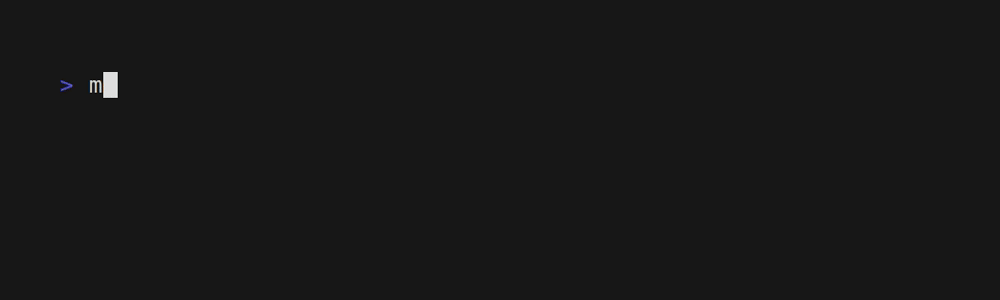

<div align="center">
     
      <h1>Matugen</h1>
 </div>
    
<div align="center">
     
     <br>
     
     
     <br> 
     <a href="#installation">Installation</a>
    ·
    <a href="#usage">Usage</a>
    ·
    <a href="#configuration">Configuration</a>
</div>

<div align="center">
  <sub>A cross-platform material you color generation tool
</div>
     
## Description

Matugen is a cross-platform tool that generates a colorscheme either from an image or a color, and exports it to a file from a template. It can also set the wallpaper if one was provided.


### About Material Design 3
[Material Design 3](https://m3.material.io/) offers a new color system that allows for more flexible and dynamic use of color. The new system includes a wider range of colors, as well as a range of tints and shades that can be used to create subtle variations in color.

### Other projects
- [Mitsugen](https://github.com/DimitrisMilonopoulos/mitsugen) - For gnome-shell, based on the [old](https://github.com/InioX/matugen/tree/python) and deprecated python version of Matugen
     
## Supported platforms
- Windows
- Linux
- MacOS
- NetBSD
>**Warning** Matugen only supports setting the wallpaper and restarting apps on Linux and NetBSD for now.
     
## Roadmap

- [ ] Add GTK4 UI
- [x] Add a light/dark/amoled option for each template
- [x] Support more color formats for generating colorscheme
    - [x] Rgba
    - [x] Rgb
    - [x] Hsl
- [ ] Suport changing the wallpaper on different platforms
     - [ ] MacOS
     - [ ] Windows
- [x] Support changing the wallpaper on X11
     - [x] Feh
     - [x] Nitrogen

>**Note** Want a feature that is not listed above? Simply [open an issue](https://github.com/InioX/Matugen/issues).

## Installation

### Cargo

```shell
cargo install matugen
```

### NixOS
Add matugen to your flake inputs:
```nix
inputs = {
  matugen = {
    url = "github:/InioX/Matugen";
    # If you need a specific version:
    ref = "refs/tags/matugen-v0.10.0"
  };
  # ...
};
```

Then you can add it to your packages:
```nix
let
  system = "x86_64-linux";
in {
  environment.systemPackages = with pkgs; [    
    # ...
    inputs.matugen.packages.${system}.default
  ];
}
```

### NetBSD
```shell
pkgin install matugen
```
or, if you prefer to build it from source
```shell
cd /usr/pkgsrc/graphics/matugen
make install
```

## Usage

### Modes


<table>
<tr>
    <td>Light</td>
    <td>Dark</td>
    <td>Amoled</sup></td>
  </tr>
    <tr>
    <td></td>
    <td></td>
    <td></td>
  </tr>
</table>

### Palettes


<table>
<tr>
    <td>Default</td>
    <td>Triadic</td>
    <td>Adjacent</sup></td>
  </tr>
    <tr>
    <td></td>
    <td></td>
    <td></td>
  </tr>
</table>

### Help


```sh
matugen -h
matugen --help
```

### Show colors


```sh
matugen --show-colors <other-arguments>
```

### Verbose mode


```sh
matugen -v <other-arguments>
```
     
### Generate from an image


```sh
# Dark mode
matugen image /path/to/wallpaper/ -m "dark"
# Light mode
matugen image /path/to/wallpaper/ -m "light"
# AMOLED/"pure dark" mode
matugen image /path/to/wallpaper/ -m "amoled"

```
Example:
```sh
matugen image ~/wall/snow.png -l
```
     
### Generate from a color


```sh
# Dark mode
matugen color hsl <hsl color> -m "dark"
# Light mode
matugen color hex <hex color> -m "light"
# AMOLED/"pure dark" mode
matugen color rgb <rgb color> -m "amoled"
```
Example:
```sh
matugen color hex "#ffbf9b"
matugen color rgb "rgb(63, 106, 171)" -m "light"
matugen color hsl "hsl(216.34, 45.75%, 45.88%)" -m "amoled"
```

### Creating templates
The basic syntax for using colors is `prefix + {color}` (The default prefix is `@`, so the usage would be `@{color}`).

#### Keywords
```css
@define-color primary @{primary}; /* Result: #ffb783 */
@define-color primary @{primary.hex}; /* Result: #ffb783 */
@define-color primary @{primary.rgb}; /* Result: rgb(255, 183, 131) */
@define-color primary @{primary.rgba}; /* Result: rgba(255, 183, 131, 255) */
@define-color primary @{primary.strip}; /* Result: ffb783 */

```

You can get the source color (color used for generating colorscheme) by using:
```css
@import url("@{source_color}"); /* Result: #ffb783*/
```

You can also get the image (if it was provided) by using:
```css
@import url("@{image}"); /* Result: /home/ini/Downloads/wallpaper.jpg */
```
>**Note** If no image was provided, Matugen will just skip over the image keyword

#### Example of all the color keywords:
```css
/*colors.css*/
@define-color primary @{primary};
@define-color on_primary @{on_primary};
@define-color primary_container @{primary_container};
@define-color on_primary_container @{on_primary_container};
@define-color secondary @{secondary};
@define-color on_secondary @{on_secondary};
@define-color secondary_container @{secondary_container};
@define-color on_secondary_container @{on_secondary_container};
@define-color tertiary @{tertiary};
@define-color on_tertiary @{on_tertiary};
@define-color tertiary_container @{tertiary_container};
@define-color on_tertiary_container @{on_tertiary_container};
@define-color error @{error};
@define-color on_error @{on_error};
@define-color error_container @{error_container};
@define-color on_error_container @{on_error_container};
@define-color background @{background};
@define-color on_background @{on_background};
@define-color surface @{surface};
@define-color on_surface @{on_surface};
@define-color surface_variant @{surface_variant};
@define-color on_surface_variant @{on_surface_variant};
@define-color outline @{outline};
@define-color shadow @{shadow};
@define-color scrim @{scrim};
@define-color inverse_surface @{inverse_surface};
@define-color inverse_on_surface @{inverse_on_surface};
@define-color inverse_primary @{inverse_primary};

@define-color source_color @{source_color};
@define-color color_accent_primary @{color_accent_primary};
@define-color color_accent_primary_variant @{color_accent_primary_variant};
@define-color color_accent_secondary @{color_accent_secondary};
@define-color color_accent_secondary_variant @{color_accent_secondary_variant};
@define-color color_accent_tertiary @{color_accent_tertiary};
@define-color color_accent_tertiary_variant @{color_accent_tertiary_variant};
@define-color text_color_primary @{text_color_primary};
@define-color text_color_secondary @{text_color_secondary};
@define-color text_color_tertiary @{text_color_tertiary};
@define-color text_color_primary_inverse @{text_color_primary_inverse};
@define-color text_color_secondary_inverse @{text_color_secondary_inverse};
@define-color text_color_tertiary_inverse @{text_color_tertiary_inverse};
@define-color color_background @{color_background};
@define-color color_background_floating @{color_background_floating};
@define-color color_surface @{color_surface};
@define-color color_surface_variant @{color_surface_variant};
@define-color color_surface_highlight @{color_surface_highlight};
@define-color surface_header @{surface_header};
@define-color under_surface @{under_surface};
@define-color off_state @{off_state};
@define-color accent_surface @{accent_surface};
@define-color text_primary_on_accent @{text_primary_on_accent};
@define-color text_secondary_on_accent @{text_secondary_on_accent};
@define-color volume_background @{volume_background};
@define-color scrim_android @{scrim_android};
```

## Configuration
Here is a list of different locations for the configuration file:
- Windows: `C:\Users\user\AppData\Roaming\InioX\matugen\config\config.toml`
- Linux: `/home/user/.config/matugen/config.toml`
- MacOS: `/Users/user/Library/Application Support/com.InioX.matugen/config.toml`

>**Note** You can also use a custom configuration path by using the `-c` argument

### Configuration items
| Name                 | Type          | Default   | Description                                                                                     |
|----------------------|---------------|-----------|-------------------------------------------------------------------------------------------------|
| reload_apps          | bool          | false     | Whether to reload apps.                                                                         |
| set_wallpaper        | bool          | false     | Whether to set the wallpaper (if `true`, requires `wallpaper_tool` to be set).                  |
| wallpaper_tool       | String        | None      | The wallpaper tool to use (`Swwww`, `Swaybg`, `Feh`, `Nitrogen`).                               |
| prefix               | String        | "@"       | The prefix to use (for example: `@{primary}`)                                                   |
| ~~reload_gtk_theme~~ | ~~bool~~      | ~~false~~ | ~~Whether to reload the gtk theme.~~ **REMOVED, USE `gtk_theme` in `config.reload_apps_list`.** |
| run_after            | Vec<String>   | []        | The commands to run after the templates have been generated.                                    |
| swww_options         | <Vec<String>> | []        | The options to use for [Swwww](https://github.com/Horus645/swww)                                |
| feh_options          | <Vec<String>> | []        | The options to use for [Feh](https://github.com/derf/feh)                                       |

### Apps
| Name      | Type | Default | Description                      |
|-----------|------|---------|----------------------------------|
| kitty     | bool | true    | Whether to reload kitty.         |
| waybar    | bool | true    | Whether to reload waybar.        |
| dunst     | bool | true    | Whether to reload dunst.         |
| gtk_theme | bool | true    | Whether to reload the GTK theme. |

### Example
```toml
# config_directory/config.toml
[config]
reload_apps = true
set_wallpaper = true
wallpaper_tool = 'Swww'
prefix = '@'
swww_options = [
    "--transition-type",
    "center",
]
run_after = [
    [ "echo", "'hello'" ],
    [ "echo", "'hello again'" ],
]

[config.reload_apps_list]
waybar = true
kitty = true
gtk_theme = true
dunst = true
```

### Adding templates
| Name            | Type                  | Default                   | Description                             |
|-----------------|-----------------------|---------------------------|-----------------------------------------|
| mode            | Option\<Modes\>       | Mode provided in args     | Which scheme to use for the template.   |
| input_path      | PathBuf               | None                      | Path to the template file.              |
| output_path     | PathBuf               | None                      | Path to export the template to.         |

### Modes
>**Note** The `mode` key will override the mode specified in the arguments, only for that template.

For all available modes, look at the <a href="#usage">usage</a>.

### Example
```toml
# config_directory/config.toml

[templates.test] # First way of adding template
input_path = '~/.config/example/template.css'
output_path = '~/.config/example'
mode = "Light" # First letter MUST be upper-case

[templates] # Another way
test2 = { input_path = '~/.config/example/template2.css', output_path = '~/.config/example2' }
```

## Acknowledgment
- [material-color-utilities-rs](https://github.com/alphaqu/material-color-utilities-rs)
