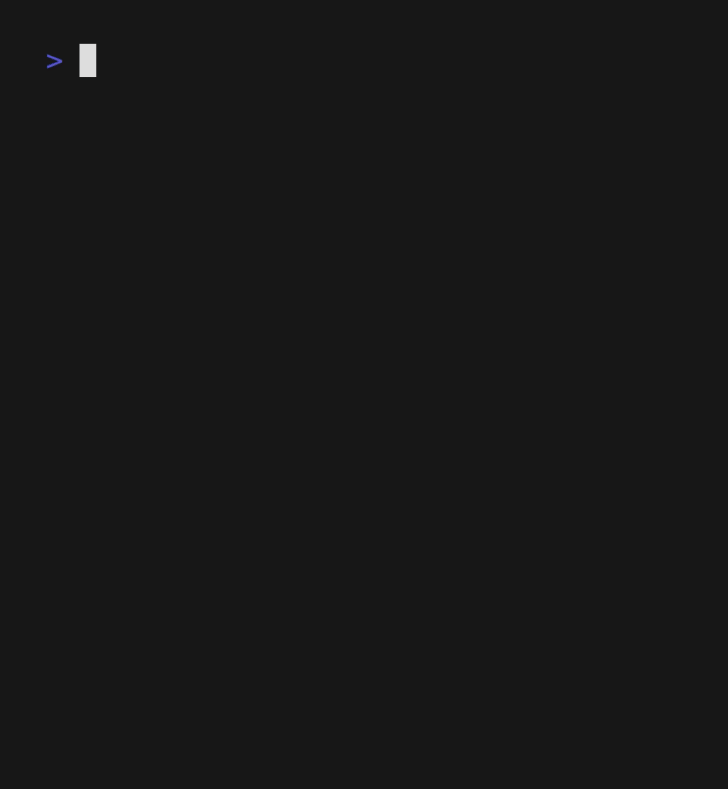
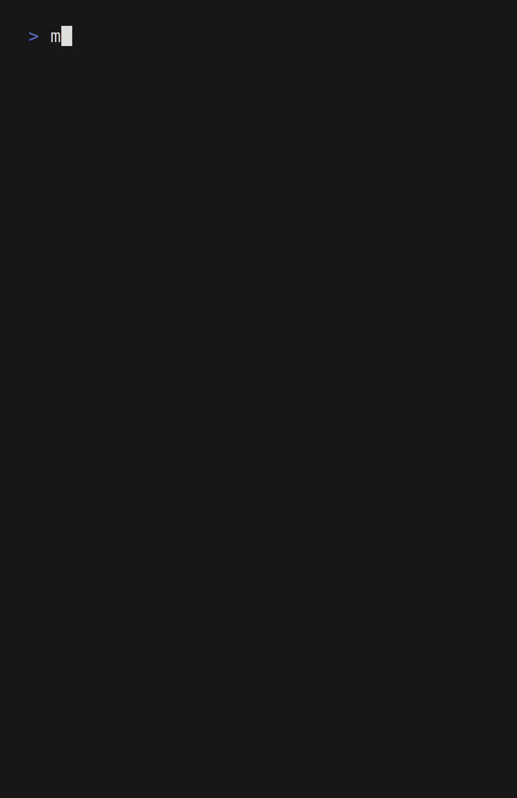
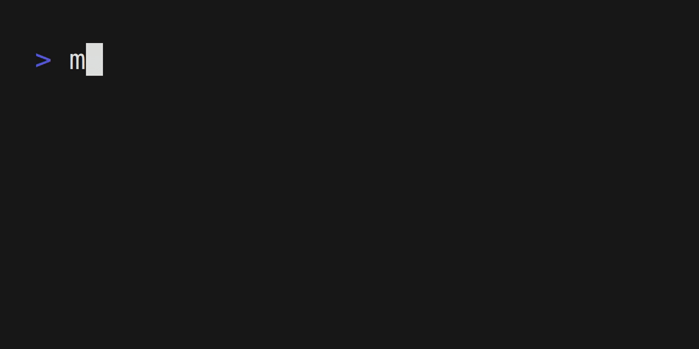
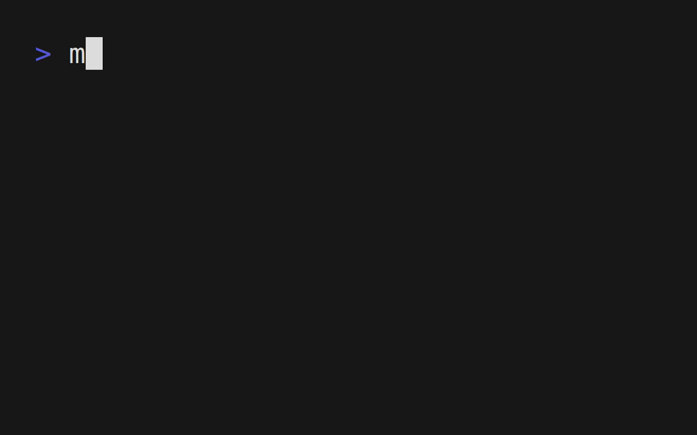

<div align="center">
     
      <h1>Matugen</h1>
 </div>
    
<div align="center">
     
     <br>
     
     
     <br> 
     <a href="#installation">Installation</a>
    ·
    <a href="#usage">Usage</a>
    ·
    <a href="#configuration">Configuration</a>
</div>

<div align="center">
  <sub>A cross-platform material you color generation tool
</div>
     
## Description

Matugen is a cross-platform tool that generates a colorscheme either from an image or a color, and exports it to a file from a template. It can also set the wallpaper if one was provided.


### About Material Design 3
[Material Design 3](https://m3.material.io/) offers a new color system that allows for more flexible and dynamic use of color. The new system includes a wider range of colors, as well as a range of tints and shades that can be used to create subtle variations in color.

### Other projects
- [Mitsugen](https://github.com/DimitrisMilonopoulos/mitsugen) - For gnome-shell, based on the [old](https://github.com/InioX/matugen/tree/python) and deprecated python version of Matugen
     
## Supported platforms
- Windows
- Linux
- MacOS
>**Warning** Matugen only supports setting the wallpaper and restarting apps on Linux for now.
     
## Roadmap

- [ ] Add GTK4 UI
- [ ] Add a light/dark option for each template
- [ ] Improve error handling when using hex color for generating colorscheme
- [ ] Support more color formats for generating colorscheme
    - [ ] Rgba
    - [ ] Rgb
    - [ ] Hsl
- [ ] Suport changing the wallpaper on different platforms
     - [ ] MacOS
     - [ ] Windows
- [ ] Support changing the wallpaper on X11
     - [ ] Feh
     - [ ] Nitrogen

>**Note** Want a feature that is not listed above? Simply [open an issue](https://github.com/InioX/Matugen/issues).

## Installation

### Cargo

```shell
cargo install matugen
```

### NixOS
Add matugen to your flake inputs:
```nix
inputs = {
  matugen = {
    url = "github:/InioX/Matugen";
  };
  # ...
};
```
Then you can add it to your packages:
```nix
let
  system = "x86_64-linux";
in {
  environment.systemPackages = with pkgs; [    
    # ...
    inputs.matugen.packages.${system}.default
  ];
}
```

## Usage

### Help


```sh
matugen -h
matugen --help
```

### Verbose mode


```sh
matugen -v <other-arguments>
```
     
### Generate from an image


```sh
# Dark theme
matugen image /path/to/wallpaper/
# Light theme
matugen image /path/to/wallpaper/ -l
```
Example:
```sh
matugen image ~/wall/snow.png -l
```
     
### Generate from a color


```sh
# Dark theme
matugen color <hex color>
# Light theme
matugen color <hex color> -l
```
Example:
```sh
matugen color #ffbf9b
matugen color ffbf9b -l
```

### Creating templates
The basic syntax for using colors is `prefix + {color}` (The default prefix is `@`, so the usage would be `@{color}`).

#### Keywords
```css
@define-color primary @{primary.hex}; /* Result: #ffb783 */
@define-color primary @{primary.rgb}; /* Result: rgb(255, 183, 131) */
@define-color primary @{primary.rgba}; /* Result: rgba(255, 183, 131, 255) */
@define-color primary @{primary.strip}; /* Result: ffb783 */

```

You can also get the image (if it was provided) by using:
```css
@import url("@{image}"); /* Result: /home/ini/Downloads/wallpaper.jpg */
```
>**Note** If no image was provided, Matugen will just skip over the image keyword

#### Example of all the color keywords:
```css
/*colors.css*/
@define-color primary @{primary.rgb};
@define-color onPrimary @{on_primary.rgb};
@define-color primaryContainer @{primary_container.strip};
@define-color onPrimaryContainer @{on_primary_container};
@define-color secondary @{secondary};
@define-color onSecondary @{on_secondary.strip};
@define-color secondaryContainer @{secondary_container.rgba};
@define-color onSecondaryContainer @{on_secondary_container};
@define-color tertiary @{tertiary};
@define-color onTertiary @{on_tertiary};
@define-color tertiaryContainer @{tertiary_container};
@define-color onTertiaryContainer @{on_tertiary_container.strip};
@define-color error @{error};
@define-color onError @{on_error.rgba};
@define-color errorContainer @{error_container.rgba};
@define-color onErrorContainer @{on_error_container};
@define-color background @{background};
@define-color onBackground @{on_background.strip};
@define-color surface @{surface};
@define-color onSurface @{on_surface};
@define-color surfaceVariant @{surface_variant};
@define-color onSurfaceVariant @{on_surface_variant};
@define-color outline @{outline.rgba};
@define-color shadow @{shadow};
@define-color inverseSurface @{inverse_surface.strip};
@define-color inverseOnSurface @{inverse_on_surface};
@define-color inversePrimary @{inverse_primary.strip};
```

## Configuration
Here is a list of different locations for the configuration file:
- Windows: `C:\Users\user\AppData\Roaming\InioX\matugen\config\config.toml`
- Linux: `/home/user/.config/matugen/config.toml`
- MacOS: `/Users/user/Library/Application Support/com.InioX.matugen/config.toml`

>**Note** You can also use a custom configuration path by using the `-c` argument

### Configuration items
```toml
# config_directory/config.toml
[config]
reload_apps = true 
set_wallpaper = true
wallpaper_tool = 'Swww'
prefix = '@'
reload_gtk_theme = true
swww_options = [
    "--transition-type",
    "center",
]
feh_options = [
    "--bg-tile",
]
run_after = [
  [ "echo", "'hello'" ]
]
```

### Adding templates
```toml
# config_directory/config.toml

[templates.test] # First way of adding template
input_path = '~/.config/example/template.css'
output_path = '~/.config/example'

[templates] # Another way
test2 = { input_path = '~/.config/example/template2.css', output_path = '~/.config/example2' }
```

## Acknowledgment
- [material-color-utilities-rs](https://github.com/alphaqu/material-color-utilities-rs)